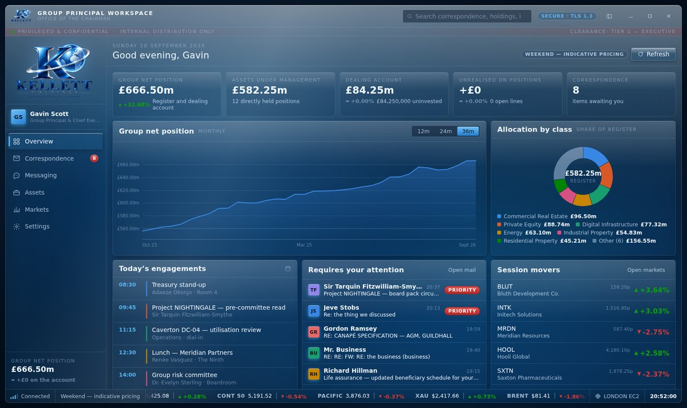
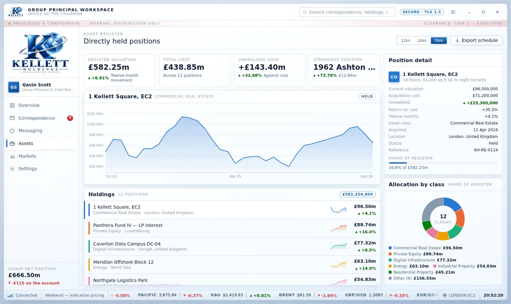

# Kellett Holdings — Group Principal Workspace

A single-window desktop workspace for a diversified holding company: correspondence,
secure messaging, the asset register and a dealing desk, behind one piece of glass.

It is a plain HTML, CSS and JavaScript application with **no build step, no package
to install and no server**. Open `index.html` in a browser and it runs. Every figure
it shows is produced on the machine it is running on; it makes no network connections
of any kind.





## Running it

Double-click `index.html`, or open it from the browser's File → Open. Chromium-based
browsers, Firefox and Safari are all fine. Keep the folder together — `index.html`,
`css/`, `js/` and `assets/` are one unit.

If you would rather serve it over HTTP (any static server will do):

```
npx http-server . -p 8080     # then visit http://localhost:8080
```

## What is in it

| Panel | What it does |
|---|---|
| **Overview** | Group net position over 12/24/36 months, allocation by class, the day's engagements, correspondence awaiting you, session movers and a group activity feed. |
| **Correspondence** | Eight mailboxes, a three-pane reader with attachments and classification tags, flagging, deletion, and a working composer that files what you send into Sent Items. |
| **Messaging** | Ten channels with history, live incoming replies, typing indicators, unread counts, and answers that come back when you write. |
| **Assets** | Twelve directly held positions with 36 months of valuation history, sparklines, a full position record, allocation by class and a twelve-month movement ranking. |
| **Markets** | Twenty-four instruments on a live watchlist, intraday and 90-session charts, a market depth ladder, a dealing ticket with commission and stamp duty, positions and an order blotter. |
| **Settings** | Identity, theme, accent, density, effects, motion, currency, market pace, notifications, the dealing account and stored data. |

## Making it yours

Everything on the **Settings** panel is yours to change — your name, job title, division,
organisation, location, email address and document reference all flow straight through to
the sidebar, the title bar, the lock screen and anything you send.

Two themes ship, both drawn by hand rather than one inverted from the other: **Midnight**
(deep navy, lit from above) and **Daylight** (white glass over a pale blue desk).
**Automatic** follows the operating system and switches with it. Five accent colours,
three layout densities, and switches for the glass effects, interface motion and the
ticker tape.

### Keyboard

| Keys | Action |
|---|---|
| `Ctrl`/`⌘` + `1`–`6` | Jump to a panel |
| `↑` `↓` `Home` `End` | Move through the navigation when it has focus |
| `Ctrl`/`⌘` + `L` | Lock the workstation |
| `Enter` in the search box | Search correspondence |
| `Enter` / `Shift`+`Enter` in a message | Send / new line |
| `Esc` | Restore a minimised window |

## Dealing

The dealing account opens with settled cash you can change in Settings. Orders execute
at the prevailing quote and are charged properly on both sides — 0.12% commission
(minimum £12.50), 0.5% stamp duty on purchases, and a £1 levy above £10,000 — so a
round trip costs you money, as it should. Short selling is refused, as are orders beyond
your settled cash or the single-ticket limit. Positions, cash and the blotter are kept
between sessions.

Prices follow a geometric random walk with a small per-instrument drift: log-normal
steps, so a price can wander a long way but never through zero. History is generated
once from a fixed seed per instrument, so the charts are the same each time you open the
workspace — only the live tail moves. The London cash session is respected: prices still
breathe outside it, but more quietly.

## How it is put together

```
index.html            The shell, the icon sprite and the script order
css/
  tokens.css          Design tokens — the two themes, accents, density, motion
  base.css            Reset, the lit background, window shell, status bar
  glass.css           The glass recipe: gloss, rim, buttons, panels, sidebar
  components.css      Tiles, tables, rows, chips, fields, charts, ticker tape
  views.css           Per-panel layouts and their breakpoints
js/
  core.js             DOM builder, seeded RNG, resize observation, event bus
  format.js           Money, percentages, dates, names — one place decides
  store.js            Guarded persistence with an in-memory fallback
  charts.js           Inline SVG: time series, sparkline, bars, donut, candles
  market.js           The pricing engine, dealing costs and the portfolio
  data/               People, instruments, the asset register, mail, messages
  views/              One module per panel
assets/
  kellett-logo*.png   The supplied mark, trimmed and scaled — never redrawn
  source/             The original artwork exactly as supplied
test/
  ui-check.mjs        Behavioural checks
  screenshots.mjs     Walks every panel in both themes and writes screenshots
```

Scripts are classic `<script>` tags in dependency order, hanging off one global, `KH`,
because that is what runs from `file://` without a toolchain. There is no framework.

### Design

The look is late-2000s Aero, borrowed from the MyMedia project's style guidelines and
brought back to a desktop: a specular sweep across the top of every surface, a bright
refractive rim, a cool bleed underneath, and a background that drifts slowly enough that
you only notice it if you look.

Chart colours are a fixed eight-slot categorical palette, assigned in order and never
cycled, validated for colour-vision deficiency against both theme surfaces. A ninth
category folds into "Other". Direction is always carried by a glyph and a sign as well
as by colour, so nothing in the application depends on colour alone. Every donut and
stacked bar ships with a legend carrying the values.

### Accessibility

Semantic roles throughout (`tablist`/`tab`/`tabpanel` navigation with roving tabindex
and arrow-key movement), visible focus rings that appear for keyboard use and not for the
mouse, full keyboard operation, `aria-label`s on every icon-only control, live regions for
notifications, and `prefers-reduced-motion` honoured — with an in-app motion switch for
anyone whose system setting says otherwise.

### Privacy and safety

- **No network.** A Content Security Policy pins `connect-src` to `'none'` and scripts,
  styles and images to the application's own folder. There are no third-party scripts,
  fonts or trackers. A test asserts that nothing but `file://` is ever requested.
- **No markup injection.** Elements are built through one helper that sets text through
  `textContent`; there is deliberately no `innerHTML` path, so a hostile display name
  stays a display name. This is covered by a test.
- **Storage is a privilege, not a guarantee.** Every read and write is guarded and falls
  back to memory, so the workspace still opens in a private window or with site data
  blocked — it says so on the Settings panel when that happens.
- Everything the application stores stays in the browser it is stored in. Nothing leaves
  the machine, because nothing can.

## Tests

The checks drive a real browser, so they need Playwright:

```
npm install
npx playwright install chromium
npm test        # behavioural checks
npm run shots   # writes a screenshot of every panel to test/shots/
```

`npm test` covers keyboard navigation, the lock screen, the rail and maximise states,
order rejection on every invalid path, a buy/sell round trip including costs, persistence
across a reload, currency switching, search, markup injection, reduced effects, unread
counts and the no-network guarantee. All 23 pass on Chromium.

## Notes

The correspondence, the messages, the asset register and the instrument book are content
shipped with the application and generated on your machine. The logo is used exactly as
supplied — trimmed of its empty margin and scaled, never redrawn.

**Kellett Holdings — A Brighter Tomorrow. Together.**
