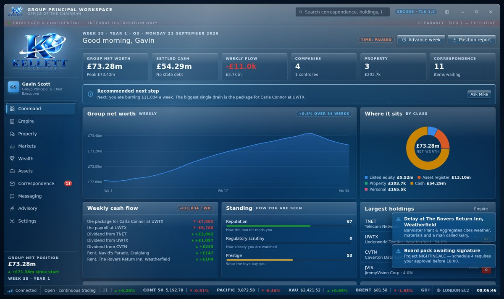
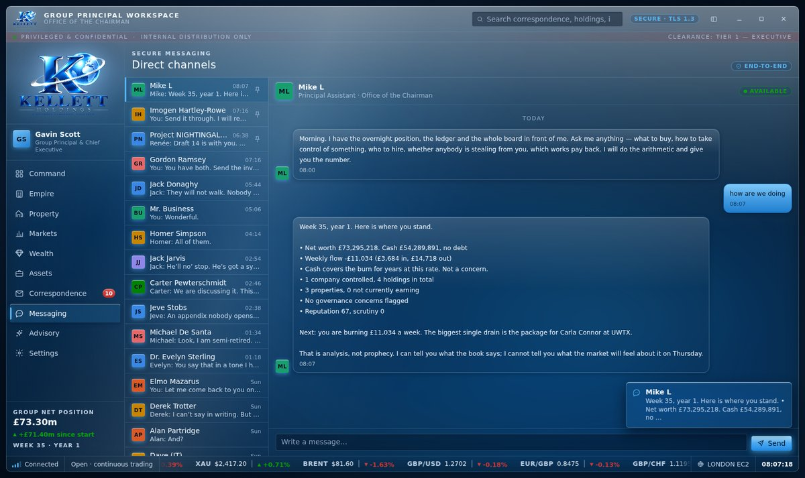

# Kellett Holdings — Group Principal Workspace

A business simulation that looks exactly like the front office of a diversified
holding company. You buy companies on a live exchange, take control of them, run
them, build a property empire, and answer your correspondence — and every one of
those decisions moves the market you are trading in.

It is plain HTML, CSS and JavaScript with **no framework, no package to install
and no server**. Everything happens on the machine it is running on, and it makes
no network connections of any kind.



It ships two ways:

- **`dist/KellettHoldings.html`** — one self-contained file with every stylesheet,
  script and image inlined. Copy it anywhere, double-click it, and it works offline
  with nothing beside it.
- **The source tree** — the same application across `index.html`, `css/`, `js/` and
  `assets/`, which also runs straight from the filesystem.

Rebuild the single file with `python3 build.py` (Python 3, no dependencies).

## Running it

Double-click **`dist/KellettHoldings.html`**. That is the whole instruction.
Chromium-based browsers, Firefox and Safari are all fine. To work on the source
instead, open `index.html`, keeping `css/`, `js/` and `assets/` beside it.

## The game

### Buy a company, then run it

The exchange is not decoration and the companies on it are not scenery. Fifty-two
listed corporates each carry real fundamentals — revenue, operating margin,
headcount, product ranges, a risk rating — and a **fair value** of earnings times a
sector multiple over shares in issue. Each simulated week a price anchor steps 19%
of the way toward fair value and the quote walks around that anchor. Improve a
company and the price follows, a month or so later. That lag is the whole game.

| Stake | What it gets you |
|---|---|
| Any | Dividends: your share of 42% of earnings, every week |
| 25% | A board seat — appoint a chief executive, commission marketing |
| 50% | Control — strategy, pricing, specification and the payroll. **And you fund the losses.** |

Every company carries a **turnaround score** out of 100, blending margin, risk,
morale and scale, so you can see at a glance how hard a rescue would be. One
company on the board scores zero and always will.

### Run it properly

- **Strategy** — seven postures from cost leadership to harvesting for cash, each
  trading margin against demand against risk.
- **People** — seven senior roles, each moving a specific lever. A shortlist of three
  candidates per search, with real capability scores. Dismissals cost a settlement
  and morale.
- **Ranges and pricing** — every company has product ranges with a price index and a
  specification. Ten points of price is roughly nine points of volume and three and
  a half of margin. Specification costs cash now and buys pricing room later.
- **Marketing** — seven channels, each with its own reach and decay. Television has
  the biggest reach and the worst return; trade press is the cheapest demand you
  will ever buy. A marketing lead on the payroll multiplies all of it.
- **Governance** — appoint one of eighteen executives, each with competence,
  integrity and ambition. The brilliant ones steal. Suspicion builds, and above 55 a
  whistleblower can go public in any week: you recover 34% and lose eleven points of
  reputation. A forensic audit first recovers 62% and costs you nothing but the fee.
  A compliance officer on the payroll roughly halves what can be taken.

### Property

Twenty listings from a terrace in Weatherfield to a tower in Nishi-Shinjuku, priced
on realistic gross yields. Buy, let, and renovate: **four builders quote at once**
and no two agree, because cheap, fast and good is a choice of two. Works void the
property while they are on site, so the rent stops before the value arrives. The
cheapest quote is cheap because they will not turn up, and every missed week is
another week of nothing coming in.

### Wealth, and the floor under everything

Twenty things to buy for yourself, from a steel chronograph to a private island.
Some appreciate, most do not, and two are written to zero the moment you sign. All
of them raise prestige, which is its own reward and not a financial one.

And there is **no game over**. Go below zero and HM Treasury puts terms on the
table: enough to clear the hole, in exchange for equity, interest, reputation and a
period of oversight. Each round is worse than the last. You cannot lose — you can
only end up owning less and less of what you built.

## The two advisers



**Mike L** — principal assistant, in the Messaging panel. He reads the live state of
the group, does the arithmetic, and answers with the actual numbers and the actual
next step. He tolerates typos through an edit-distance matcher, and he is not only
an adviser: **tell him and he does it.**

```
"Buy £250k of TNET"          "Take control of CVTN"        "Sell all JVIS"
"Hire a compliance officer"  "Appoint a chief executive"   "Audit PWTR"
"Switch TNET to turnaround"  "Put prices up at NRTH"       "Launch a trade press campaign"
"Buy 1 Coronation Street"    "Get quotes for a kitchen"    "Accept the best quote"
"Advance three weeks"        "Pause time"                  "Export the position report"
```

He asks a question back rather than obeying one ("how do I take over GLBX" gets
analysis; "take control of GLBX" gets a contract note). He is a genius and he is
**not a cheat code**, because he has two immovable biases he tells you about up
front: he will never recommend outsourcing, offshoring or cost-cutting your way to
margin, and he can read every figure in the group but none of the ones in the
future. He is delighted by anything to do with BlackBerry, furious about anything
to do with Apple, and does not want to talk about the Storm.

**Jimmy** — retained advisory, at nine hundred thousand a year. Every figure he
quotes is live and correct. Every conclusion he draws from those figures will ruin
you. He opens with "now then, now then" and closes with an invoice.

## Everything else

- **Correspondence** — eight mailboxes, and replies that are **decisions**: cash
  moves, reputation moves, and the answer that comes back depends on what you chose.
  Recorded on the save, so each is taken once.
- **Messaging** — sixteen channels with live incoming replies and typing indicators.
- **Markets** — the full exchange with intraday and 90-session charts, a depth
  ladder, and a dealing ticket that charges commission, stamp duty and a levy.
- **Register** — the founding asset book with 36 months of valuations.
- **Command** — net worth over time, weekly cash flow broken down line by line,
  standing meters, group news, and the single most useful next action.

### Exports, which are real

Five PDFs, written by a hand-rolled PDF writer with no dependencies: group position,
a board pack for any company, the property schedule, the transaction ledger and the
market sheet. Proper A4 documents with running headers, page numbers, tables and a
signature block. They open, they print, and they work offline.

### Time

A Sims-style speed control under **Settings → Simulation**: paused, slow, normal,
fast, rapid — or step exactly one week at a time from Command. Everything settles on
the week: fundamentals, payroll, rent, building works, chief executives and their
expenses, the news, and the price the market puts on all of it.

### Saving

The game saves itself continuously. **Settings → Saved game** exports the whole thing
as a file you can keep or move to another machine, and reads it back.

### Group capitalisation

One logarithmic dial scales the entire world, from **£15,000** to **£15,000,000**:
the asset register, the dealing account, the property market, the lifestyle
catalogue and every company's market capitalisation all move together, so the game
is the same shape whether you are a modest landlord or a principal tier institution.

## Making it yours

Identity, theme, accent, density, effects, motion, sounds and reporting currency are
all in Settings, and your name, title and division flow through to the sidebar, the
lock screen, the correspondence and every PDF.

Two themes, both drawn by hand rather than one inverted from the other: **Midnight**
and **Daylight**, with **Automatic** following the operating system.

### Keyboard

| Keys | Action |
|---|---|
| `Ctrl`/`⌘` + `1`–`9`, `0` | Jump to a panel |
| `↑` `↓` `Home` `End` | Move through the navigation |
| `Ctrl`/`⌘` + `L` | Lock the workstation |
| `Enter` in search | Search correspondence |
| `Enter` / `Shift`+`Enter` in a message | Send / new line |
| `Esc` | Restore a minimised window |

### Sounds

Chimes on navigation, notices, orders, the week turning and the lock screen,
synthesised live with Web Audio — warm sine partials an octave below where a
notification usually sits, a soft attack and a low-pass, so nothing pings. On by
default; the switch is under Settings.

## How it is put together

```
index.html            The shell, the icon sprite and the script order
css/                  tokens · base · glass · components · views · sim
js/
  core.js             DOM builder, seeded RNG, event bus
  format.js           Money, percentages, dates, names
  store.js            Workspace settings, guarded persistence
  charts.js           Inline SVG: time series, sparkline, bars, donut, candles
  sound.js            Web Audio voices
  pdf.js              A hand-written PDF 1.4 writer
  reports.js          The five board papers
  market.js           The exchange, dealing and the portfolio
  data/               People, instruments, the register, mail, messages
  sim/
    data.js           Executives, roles, strategies, channels, property, builders,
                      lifestyle, events
    state.js          The save game
    engine.js         Fundamentals, operations, property, lifestyle, the bailout
    clock.js          The week: settlement, executives, news, repricing
    assistant.js      Mike L — intents, entity extraction, and the command parser
    advisor.js        Jimmy
  views/              One module per panel
build.py              Bundles everything into dist/KellettHoldings.html
test/                 ui-check · sim-check · screenshots
```

Scripts are classic `<script>` tags in dependency order, hanging off one global,
`KH`, because that is what runs from `file://` without a toolchain.

### Safety and privacy

- **No network.** A Content Security Policy pins `connect-src` to `'none'`. In the
  single-file build the policy names a **SHA-256 hash of every inlined script**, so
  the bundle keeps a strict script policy rather than falling back to
  `'unsafe-inline'`.
- **No markup injection.** Elements are built through one helper that sets text via
  `textContent`; there is deliberately no `innerHTML` path. Covered by a test.
- **Storage is guarded** and falls back to memory, and the app says so when it does.
- Everything stays in the browser it is stored in. Nothing leaves the machine.

### Accessibility

Semantic `tablist`/`tab`/`tabpanel` navigation with roving tabindex and arrow keys,
visible focus rings for keyboard use only, `aria-label`s on every icon-only control,
live regions for notices, and `prefers-reduced-motion` honoured with an in-app motion
switch as well. Chart colours are a fixed eight-slot palette validated for
colour-vision deficiency against both theme surfaces; direction always carries a
glyph and a sign as well as colour.

## Tests

The checks drive a real browser, so they need Playwright:

```
npm install
npx playwright install chromium
npm test                                    # interface, both targets
npm run test:sim                            # the simulation
npm test -- dist/KellettHoldings.html       # the single-file build
npm run shots                               # a screenshot of every panel
```

`npm test` covers navigation, the lock screen, order rejection on every invalid
path, a buy/sell round trip with costs, the capitalisation dial, the sound engine,
persistence, currency, search, markup injection and the no-network guarantee.

`npm run test:sim` covers the economy and fair value, control thresholds, strategy,
hiring and dismissal, pricing, campaigns, executives and embezzlement, audits,
whether management actually moves the market, property purchase through to completed
works, the lifestyle book, the bailout and its repayment, Mike's advice and all
eight of his executed commands, his Apple/BlackBerry/Storm/offshoring triggers,
Jimmy, all five PDFs byte-for-byte, and a save/reload/import round trip.

**All checks pass on Chromium against the source tree and against the single-file
build.**

## Notes

Every company, correspondent, property and executive is fiction, and the resemblance
of certain of them to residents of Weatherfield, Springfield, Quahog, Craiglang,
Peckham, Slough, 30 Rockwell Plaza, Los Santos and one or two rather darker
fictional universes is entirely deliberate. The logo is used exactly as supplied —
trimmed of its empty margin and scaled, never redrawn.

**Kellett Holdings — A Brighter Tomorrow. Together.**
